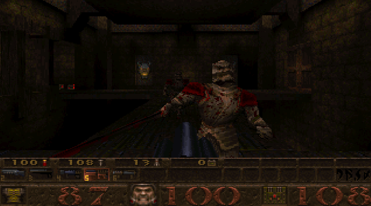

# -------------------- NAKED WINQUAKE --------------------

## GET READY TO PARTY LIKE IT'S 1996!

Whasssssuuuup, true fraggers and denizens of the deep, dark, PIXELATED netherworlds?! Tired of these so-called "Quake ports" that look like some kind of animé cartoon threw up all over your gritty, blood-soaked memories? Do you yearn for the days when 3D cards were a MYTH and REAL programmers squeezed every last ounce of performance out of the CPU like a digital god?!

**THEN PREPARE YOUR PUNY MODERN MINDS TO BE BLOWN BACK TO THE STONE AGE!**

This ain't your grandma's Quake. This ain't even your older, slightly-less-cool brother's Quake. This is **NAKED WINQUAKE** – Quake stripped bare, raw, and pulsating with the pure, unadulterated POWER of software rendering! We're talking **320x200 pixels of raw, unfiltered FURY**, baby! That's right, the resolution so chunky, so undeniably RIGHTEOUS, it'll make your eyeballs SWEAT WITH JOY!

Forget your "ChadQuake" with its... *shudder*... *polygons*. Pfft. We're talking about a level of **MEGA-CHAD** here that makes those other ports look like they're still asking their mommies to cut the crusts off their sandwiches. This is **THE WAY IT WAS MEANT TO BE PLAYED!** Each pixel is a lovingly handcrafted testament to the days when gibs were chunky enough to trip over!

---

### 🤯 SO AUTHENTIC, YOU'LL FORGET HOW TO USE A MOUSE WITH MORE THAN TWO BUTTONS! 🤯

That's right, cyber-dudes and dudettes! **NAKED WINQUAKE** is so mind-bendingly ORIGINAL, it'll practically devolve you back into a **TROGLODYTE!** You'll be grunting at your monitor, smearing ochre paint on your face, and instinctively knowing how to strafe-jump before you even knew what a "strafe" was!

We've taken the sacred WinQuake source code – the holy grail! – and made only the most **MINIMAL, BARELY-THERE TWEAKS** to drag its glorious derrière into the 64-bit era. Think of it like taking a perfectly preserved T-Rex and just, like, giving it a slightly bigger cave so it doesn't bump its head.

---

### NO "ENHANCEMENTS." JUST PURE, UNADULTERATED AWESOMENESS!

You want your "bloom lighting"? Your "particle effects"? Your "anisotropic filtering"? **GET OUTTA HERE, YA SCRIPT KIDDIE!** We wouldn't touch those so-called "enhancements" (notice the air quotes of extreme sarcasm, like, WOAH) with a ten-foot BFG!

This is **WINQUAKE WITHOUT BEING BRUTALISED!** No one has "reimagined" it. No one has "modernised" it. No one has DAREd to defile its perfect, low-res, software-rendered majesty. This is the digital equivalent of finding a mint-condition, still-in-the-box copy of your favorite childhood toy, untouched by the greasy mitts of "progress."

---

### WARNING: NOT FOR THE FAINT OF HEART (OR THOSE BORN AFTER 1990)

Let's be clear, this ain't "Quake for the masses." This ain't for the Twitchy, TikTok-brained zoomer who needs 8K resolution and 5000 shaders to feel "immersed."

**NAKED WINQUAKE IS QUAKE FOR 80'S KIDS!** It's for those of us who remember dial-up modems, the smell of ozone from a CRT monitor, and the sheer, unadulterated thrill of discovering a secret area that actually *felt* secret. It's for those of us who appreciate the raw, untamed beauty of a perfectly dithered texture and the satisfying *thunk* of a nailgun spitting out pure, pixelated death.

If you're ready to experience Quake in its most primal, most righteous, most **NAKED** form, then hit that download button, crank up the Nine Inch Nails, and prepare for a trip back to a time when games were HARD, pixels were FAT, and fun was GUARANTEED.

**NOW GO FRAG SOMETHING, YOU MAGNIFICENT B*S%ARD!**

---

**(P.S. If you don't get it, you're probably too young. Or a console peasant. Or both. No hard feelings... much.)**
